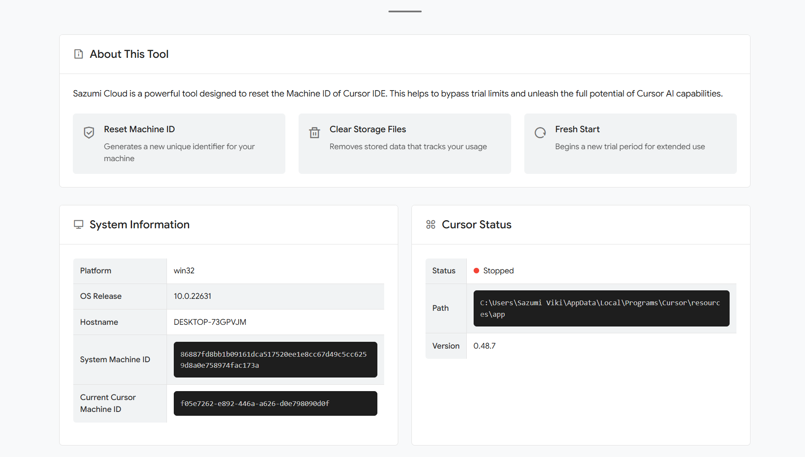
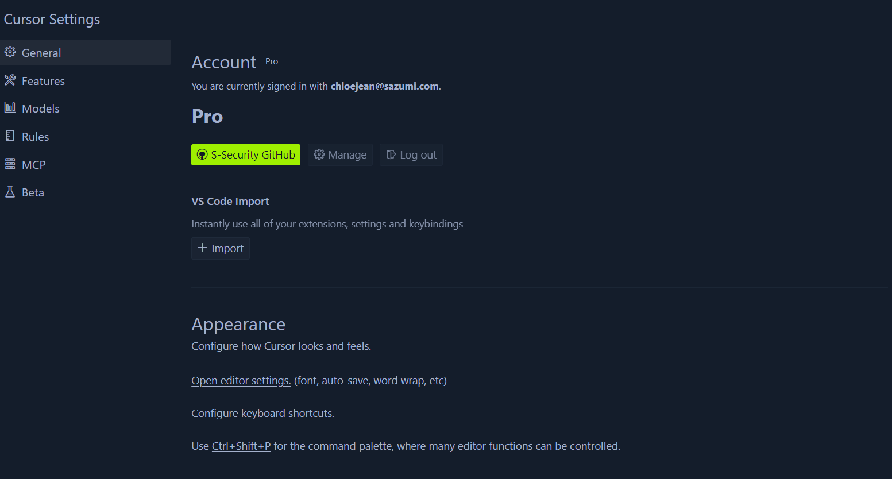

## Preview Website



## Bypass Pro Trial



A modern web-based tool to reset Cursor IDE's Machine ID, helping users to bypass trial limitations and continue using Cursor AI capabilities. This tool enables bypassing token limits, converting free trial accounts to Pro features, circumventing machine ID restrictions, and preventing automatic updates.

## Advanced Bypass Features

- **Token Limit Bypass**: Remove restrictions on token usage for AI completions
- **Pro Trial Conversion**: Access Pro features without purchasing a subscription
- **Machine ID Reset**: Bypass the "Too many free trial accounts used on this machine" limitation
- **Auto Update Prevention**: Stop Cursor from updating and potentially removing bypass functionality
- **Cross-Platform**: Compatible with Windows, macOS, and Linux
- **User-Friendly Interface**: Clean, modern UI with clear instructions
- **System Information**: Displays detailed system and Cursor installation info

## Installation

1. **Clone the repository**

```bash
git clone https://github.com/sazumivicky/cursor-reset-tools.git
cd cursor-reset-tools
```

2. **Install dependencies**

```bash
npm install
```

3. **Start the application**

```bash
npm start
```

The server will start at http://localhost:3000

## Running with Administrator Rights

This tool requires administrator privileges to modify system files.

### Windows
```bash
# Start CMD as Administrator
cd path\to\cursor-reset-tools
npm start
```

### macOS/Linux
```bash
cd path/to/cursor-reset-tools
sudo npm start
```

## How it Works

Cursor identifies your machine using a unique ID stored in specific locations:

- **Windows**: `%APPDATA%\Cursor\machineId`
- **macOS**: `~/Library/Application Support/Cursor/machineId`
- **Linux**: `~/.config/cursor/machineid`

This tool:
1. Detects if Cursor is running (and warns you to close it)
2. Generates a new UUID to replace your existing machine ID
3. Clears cached files that store your usage data
4. Prevents automatic updates that could remove bypass functionality
5. Modifies system files to unlock Pro features and bypass token limits
6. Allows Cursor to treat your machine as a new device

## 💡 Recommended Tips

For best results when creating new Cursor accounts:

- **Use Disposable Email**: We recommend using [Sazumi Cloud - Email Disposable](https://mail.sazumi.com) service which works well with Cursor and doesn't get blocked
- Reset machine ID before each new registration
- Use private/incognito browser window for registration
- Clear browser cookies after registration

## Technologies Used

- **Backend**: Node.js, Express
- **Frontend**: HTML, CSS, JavaScript
- **Template Engine**: EJS
- **Utilities**: uuid, fs-extra, node-machine-id

## ⚠️ Disclaimer

This tool is provided for educational and research purposes only. Use at your own risk. Sazumi Cloud developers are not responsible for any consequences arising from the use of this tool.

**Please consider supporting Cursor development by purchasing a legitimate license if you find their product valuable for your workflow.**

## License

This project is licensed under the MIT License - see the LICENSE file for details.

## 🤝 Contributing

Contributions are welcome! Please feel free to submit a Pull Request.

1. Fork the repository
2. Create your feature branch (`git checkout -b feature/amazing-feature`)
3. Commit your changes (`git commit -m 'Add some amazing feature'`)
4. Push to the branch (`git push origin feature/amazing-feature`)
5. Open a Pull Request

## 🔗 Links

- [GitHub Repository](https://github.com/sazumivicky/cursor-reset-tools)
- [Issue Tracker](https://github.com/sazumivicky/cursor-reset-tools/issues)
- [Donate to Sazumi Viki](https://sociabuzz.com/sazumi/tribe)

---

Made with ❤️ by Sazumi Cloud 